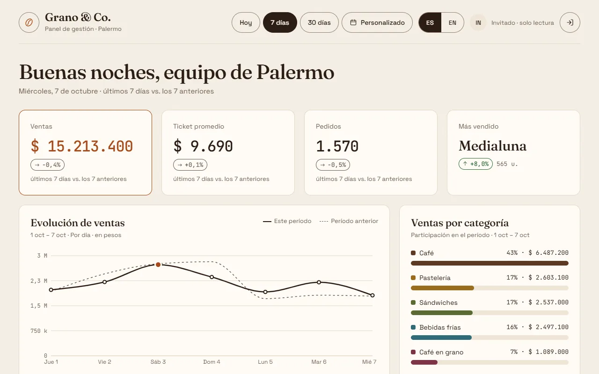
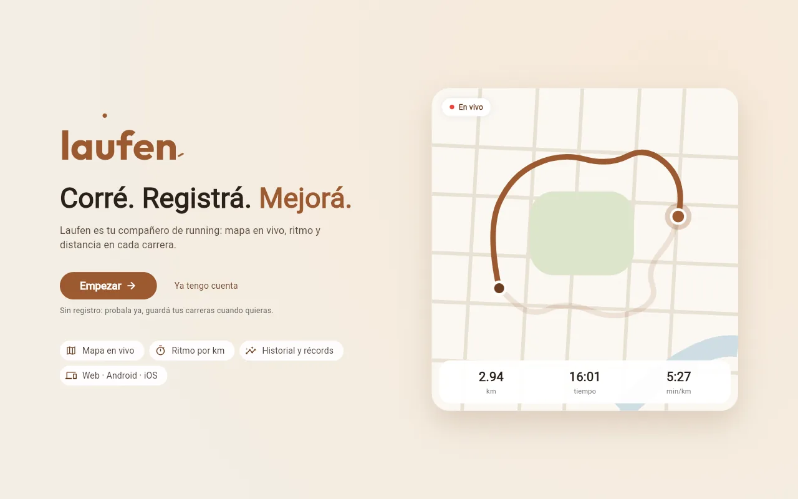
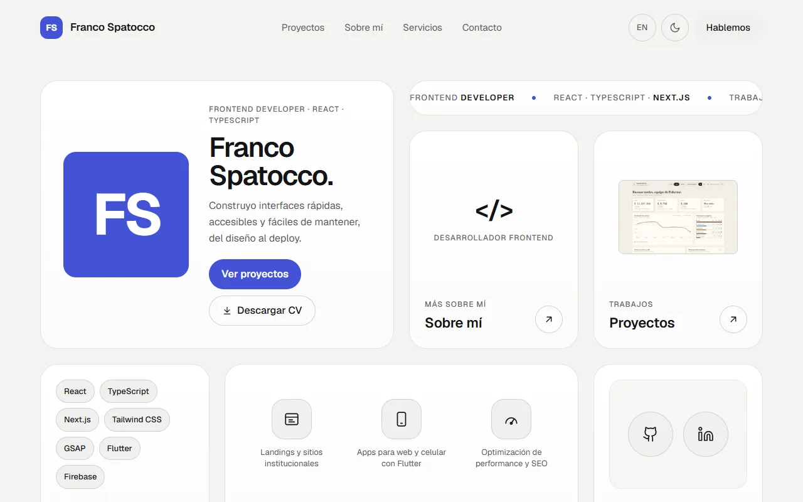

# Hola, soy Franco 👋

**Frontend Developer · React · TypeScript · Next.js · Flutter**

Analista de Sistemas. Construyo interfaces rápidas, accesibles y fáciles de mantener, del diseño al deploy: sitios y paneles web con Next.js, y apps para web y celular con Flutter. También curso la Tecnicatura en Mantenimiento Industrial y me interesa el cruce entre software, automatización e Industria 4.0.

📬 **Disponible para trabajar de forma remota**, en relación de dependencia o como freelance.

_Frontend developer (React, TypeScript, Next.js, Flutter). I build fast, accessible interfaces from design to deploy. Available for remote work, full-time or freelance._

**Stack:** React · TypeScript · Next.js · Tailwind CSS · GSAP · Flutter · Dart · Firebase · Vercel · API de Claude

## Proyectos

<table>
  <tr>
    <td colspan="2">
      
      <h3>Grano &amp; Co. · dashboard con IA</h3>
      Panel de gestión de una cafetería: ventas, pedidos y stock en una pantalla, con un resumen semanal escrito por la API de Claude. 
      Next.js · TypeScript · Firebase · TanStack Query · Recharts · API de Claude 
      <a href="https://grano-co-dashboard.vercel.app"><b>Ver demo</b></a> · <a href="https://github.com/FranSpatocco/grano-co-dashboard">Código</a>
    </td>
  </tr>
  <tr>
    <td width="50%" valign="top">
      
      <h3>Laufen · app de running</h3>
      GPS, mapa en vivo, parciales por km e intervalos. Android, iOS y web con un mismo código. 
      Flutter · Dart · Firebase 
      <a href="https://laufen-app.web.app"><b>Ver demo</b></a> · <a href="https://github.com/FranSpatocco/laufen">Código</a>
    </td>
    <td width="50%" valign="top">
      
      <h3>Portfolio</h3>
      Bilingüe (ES/EN), con animaciones y diseño de tarjetas. Lighthouse 90+ en mobile. 
      Next.js · TypeScript · Tailwind CSS · next-intl · GSAP 
      <a href="https://franco-spatocco.vercel.app"><b>Ver sitio</b></a> · <a href="https://github.com/FranSpatocco/portfolio">Código</a>
    </td>
  </tr>
</table>

## Contacto

[Portfolio](https://franco-spatocco.vercel.app) · [LinkedIn](https://www.linkedin.com/in/franco-spatocco-0a7161163/) · fspatocco02@gmail.com
